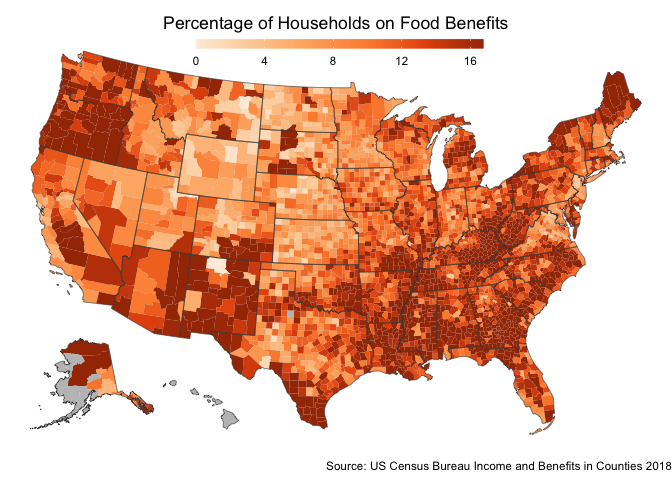

CS 372 EDA
================
Usman Khaliq
2020-06-11

  - [Downloadig Data](#downloadig-data)
  - [Plotting Chloroleth maps for Food Stamp beneficiaries in
    Counties](#plotting-chloroleth-maps-for-food-stamp-beneficiaries-in-counties)
  - [Building a model](#building-a-model)
  - [Models at region level.](#models-at-region-level.)
  - [Map of Population Density](#map-of-population-density)

``` r
# Libraries
library(tidyverse)
library(sf)
library(dcl)
library(tidycensus)
library(lubridate)
library(readxl)
# Parameters
  # US Census Bureau API query for Vintage 2018 County Population Estimates
us_census_vintage_2018 <-
  "https://api.census.gov/data/2018/pep/population?get=GEO_ID,GEONAME,DATE_CODE,DATE_DESC,POP&for=county:*"  


# URL for downloading COVID19 County data from New York Times
covid19_county_nyt <- "https://raw.githubusercontent.com/nytimes/covid-19-data/master/live/us-counties.csv"

# Data File for US Census Income and Benefits File 2018
income_and_benefits <- "/Users/usmankhaliq/Downloads/subset2018IncomeAndBenefits.csv" 

#Data file that contains hospital beds in each county
hospital_beds <- "/Users/usmankhaliq/Downloads/subset_HospitalBedData.xlsx"

#Data file that contains demographic data
demographic_data <- "/Users/usmankhaliq/Downloads/demographicData2018_RAEdits.xlsx" 

#Data file that contains data about areas of counties 
counties_area <- "/Users/usmankhaliq/Downloads/LND01.xls"

  # Map colors
MAP_COLORS <- RColorBrewer::brewer.pal(n = 9, name = "PuRd")
MAP_NA_COLOR <- "grey75" 

#Colors for the income and benefits chloropleth maps made
orange_pal <- RColorBrewer::brewer.pal(n = 6, name = "Oranges")

#Colors for hospital beds
blue_pals <- RColorBrewer::brewer.pal(n = 9, name = "Blues") 

#Colors for proportion of blacks
green_pal <- RColorBrewer::brewer.pal(n = 9, name = "Greens")  

#Colors for the population density chart
yellow_pal <- RColorBrewer::brewer.pal(n = 9, name = "YlOrRd")

#state codes for states on east coast
# new york, new jersey, conneticut, massachusetts, california
east_coast_states <- c("36", "34", "25", "09", "06")

#state codes for states in south
south_states <- c("22", "05", "28", "37", "45", "47", "01", "12") 
#===============================================================================

# Code
```

### Downloadig Data

Lets download the most recent data of the current rates of COVID-19 from
the New York Times

``` r
covid19_county_df <- 
  covid19_county_nyt %>% 
  read.csv() %>% 
  rename_all(str_to_lower) %>% 
  mutate(fips = as.integer(fips))
```

Lets download data about populations from counties for 2018.

``` r
county_populations <-
us_census_vintage_2018 %>%
  jsonlite::fromJSON() %>%
  as_tibble() %>%
  janitor::row_to_names(row_number = 1) %>%
  filter(str_detect(DATE_DESC, "^7/1/\\d{4}\\spopulation\\sestimate")) %>%
  separate(GEO_ID, c("redundant_value", "fips"), sep = "US") %>%
  mutate(
    year = str_extract(DATE_DESC, pattern = "(?<=\\d/\\d/)\\d*(?=\\s.*)")
  ) %>% 
  filter(year %in% c("2018")) %>% 
  select(
    name = GEONAME,
    fips = fips,
    year = year,
    population = POP
  ) %>% 
  mutate(
    fips = as.integer(fips),
    year = as.integer(year),
    population = as.double(population)
  ) %>% 
  arrange(fips, year)
```

    ## Warning: The `x` argument of `as_tibble.matrix()` must have column names if `.name_repair` is omitted as of tibble 2.0.0.
    ## Using compatibility `.name_repair`.
    ## This warning is displayed once every 8 hours.
    ## Call `lifecycle::last_warnings()` to see where this warning was generated.

Lets read the boundaries of US Counties

``` r
county_boundaries <- 
  ussf::boundaries(
    geography = "county",
    resolution = "20m"
  ) %>% 
  mutate(fips = as.integer(GEOID)) 
```

``` r
state_boundaries <- 
  ussf::boundaries(
    geography = "state",
    resolution = "20m"
  )
```

Lets join the COVID-19 county data with the county boundaries.

plot a simple chloropleth map of the county population densities.

``` r
counties_data <- 
  county_boundaries %>% 
  mutate(GEOID = as.integer(GEOID)) %>% 
  left_join(county_populations, by = c("GEOID" = "fips")) %>% 
  left_join(covid19_county_df, by = c("GEOID" = "fips")) %>% 
  mutate(
    cases_per_100000 = (cases / population) * 100000,
    deaths_per_100000 = (deaths / population) * 100000
  )
```

``` r
quantile(counties_data$cases_per_100000, na.rm = TRUE)
```

    ##           0%          25%          50%          75%         100% 
    ##     3.175611    78.941397   186.129884   434.040655 12704.322557

``` r
labels <- function(x) {
  if_else(x < 379, as.character(x), "140+ ")
}
counties_data %>% 
  mutate(cases_per_100000 = pmin(379, cases_per_100000)) %>% 
  ggplot() +
  geom_sf(aes(fill = cases_per_100000), size = 0.01) +
  geom_sf(data = state_boundaries, color = "grey25", fill = NA, size = 0.2) +
  scale_fill_gradientn(
    #limits = c(0, 150),
    #breaks = seq(0, 150, 75),
    labels = labels,
    colors = MAP_COLORS,
    na.value = MAP_NA_COLOR
  ) +
  guides(
    fill = 
      guide_colorbar(
        barheight = 0.5,
        barwidth = 15,
        title = NULL
      )
  ) +
  theme_void() +
  theme(
    legend.direction = "horizontal",
    legend.position = c(0.5, 0.95),
    plot.title = element_text(hjust = 0.5),
    plot.subtitle = element_text(hjust = 0.5)
  ) +
  labs(
    title = "Number of COVID-19 Cases Per 100,000 People",
    caption = "Sources: US Census Bureau \nNew York Times\nAs of June 9, 2020"
  )
```

<!-- -->

``` r
quantile(counties_data$deaths_per_100000, na.rm = TRUE)
```

    ##         0%        25%        50%        75%       100% 
    ##   0.000000   0.000000   3.628649  14.963275 347.388596

``` r
#quantile(counties_data$deaths_per_100000, na.rm = TRUE)

counties_data %>% 
  mutate(deaths_per_100000 = pmin(13, deaths_per_100000)) %>% 
  ggplot() +
  geom_sf(aes(fill = deaths_per_100000), size = 0.01) +
  geom_sf(data = state_boundaries, color = "grey25", fill = NA, size = 0.2) +
  scale_fill_gradientn(
    #limits = c(0, 150),
    #breaks = seq(0, 150, 75),
    labels = labels,
    colors = MAP_COLORS,
    na.value = MAP_NA_COLOR
  ) +
  guides(
    fill = 
      guide_colorbar(
        barheight = 0.5,
        barwidth = 15,
        title = NULL
      )
  ) +
  theme_void() +
  theme(
    legend.direction = "horizontal",
    legend.position = c(0.5, 0.95),
    plot.title = element_text(hjust = 0.5),
    plot.subtitle = element_text(hjust = 0.5)
  ) +
  labs(
    title = "Number of COVID-19 Deaths Per 100,000 People",
    caption = "Sources: US Census Bureau \nNew York Times\nAs of June 9, 2020"
  )
```

<!-- -->

``` r
quantile(counties_data$cases_per_100000, na.rm = TRUE)
```

    ##           0%          25%          50%          75%         100% 
    ##     3.175611    78.941397   186.129884   434.040655 12704.322557

``` r
quantile(counties_data$deaths_per_100000, na.rm = TRUE)
```

    ##         0%        25%        50%        75%       100% 
    ##   0.000000   0.000000   3.628649  14.963275 347.388596

### Plotting Chloroleth maps for Food Stamp beneficiaries in Counties

Lets load the data for the foodstamp beneficiaries. We will also extract
the FIPS from the GEO\_ID column so that it can be combined with the
county population values.

``` r
income_and_benefits_df <-
  income_and_benefits %>% 
  read_csv() %>% 
  mutate(geo_id = as.integer(str_remove(GEO_ID, "\\d*US")))
```

    ## Parsed with column specification:
    ## cols(
    ##   OBJECTID = col_double(),
    ##   GEO_ID = col_character(),
    ##   GEO_NAME = col_character(),
    ##   GEO_PARENT_NAME = col_character(),
    ##   Total_House_holds = col_double(),
    ##   Total_House_sup_sec_inc = col_double(),
    ##   Total_House_cash_pub_ass_inc = col_double(),
    ##   Total_House_food_stamp_ben = col_double(),
    ##   Percent_total_house_social_sec_inc = col_double(),
    ##   Percent_total_house_cash_ben = col_double(),
    ##   Percent_total_house_food_ben = col_double()
    ## )

Lets join the `income_and_benefits_df` with the `county_boundaries`
dataframe.

``` r
counties_income_and_benefit_df <- 
  county_boundaries %>% 
  mutate(GEOID = as.integer(GEOID)) %>% 
  left_join(income_and_benefits_df, by = c("GEOID" = "geo_id"))
```

Now, lets plot a chloropleth map of the percentage of total households
in counties on food stamps.

``` r
quantile(counties_income_and_benefit_df$Percent_total_house_social_sec_inc, na.rm = TRUE)
```

    ##        0%       25%       50%       75%      100% 
    ##  0.000000  4.104554  5.533163  7.357510 29.807692

``` r
counties_income_and_benefit_df %>% 
  mutate(
    percent_total_house_social_sec_inc = 
      pmin(7.357510, Percent_total_house_social_sec_inc)
  ) %>% 
  ggplot() +
  geom_sf(aes(fill = percent_total_house_social_sec_inc), size = 0.01) +
  geom_sf(data = state_boundaries, color = "grey25", fill = NA, size = 0.2) +
  scale_fill_gradientn(
    #limits = c(0, 150),
    #breaks = seq(0, 150, 75),
    labels = labels,
    colors = orange_pal,
    na.value = MAP_NA_COLOR
  ) +
  guides(
    fill = 
      guide_colorbar(
        barheight = 0.5,
        barwidth = 15,
        title = NULL
      )
  ) +
  theme_void() +
  theme(
    legend.direction = "horizontal",
    legend.position = c(0.5, 0.95),
    plot.title = element_text(hjust = 0.5),
    plot.subtitle = element_text(hjust = 0.5)
  ) +
  labs(
    title = "Percentage of Households on Social Security Income",
    caption = "Source: US Census Bureau Income and Benefits in Counties 2018"
  )
```

<!-- -->

Now, lets plot a chloropleth map for percentage of households on cash
benefits.

``` r
quantile(counties_income_and_benefit_df$Percent_total_house_cash_ben, na.rm = TRUE)
```

    ##        0%       25%       50%       75%      100% 
    ##  0.000000  1.363302  1.966955  2.873391 29.032258

``` r
counties_income_and_benefit_df %>% 
  mutate(
    percent_total_house_cash_ben = 
      pmin(2.873391, Percent_total_house_cash_ben)
  ) %>% 
  ggplot() +
  geom_sf(aes(fill = percent_total_house_cash_ben), size = 0.01) +
  geom_sf(data = state_boundaries, color = "grey25", fill = NA, size = 0.2) +
  scale_fill_gradientn(
    #limits = c(0, 150),
    #breaks = seq(0, 150, 75),
    labels = labels,
    colors = orange_pal,
    na.value = MAP_NA_COLOR
  ) +
  guides(
    fill = 
      guide_colorbar(
        barheight = 0.5,
        barwidth = 15,
        title = NULL
      )
  ) +
  theme_void() +
  theme(
    legend.direction = "horizontal",
    legend.position = c(0.5, 0.95),
    plot.title = element_text(hjust = 0.5),
    plot.subtitle = element_text(hjust = 0.5)
  ) +
  labs(
    title = "Percentage of Households on Cash Benefits",
    caption = "Source: US Census Bureau Income and Benefits in Counties 2018"
  )
```

<!-- -->

Now, lets plot the Proportion of Households that received food stamps.

``` r
quantile(counties_income_and_benefit_df$Percent_total_house_food_ben, na.rm = TRUE)
```

    ##        0%       25%       50%       75%      100% 
    ##  0.000000  8.617023 12.412315 16.748792 53.510638

``` r
counties_income_and_benefit_df %>% 
  mutate(
    percent_total_house_food_ben = 
      pmin(16.748792, Percent_total_house_food_ben)
  ) %>% 
  ggplot() +
  geom_sf(aes(fill = percent_total_house_food_ben), size = 0.01) +
  geom_sf(data = state_boundaries, color = "grey25", fill = NA, size = 0.2) +
  scale_fill_gradientn(
    #limits = c(0, 150),
    #breaks = seq(0, 150, 75),
    labels = labels,
    colors = orange_pal,
    na.value = MAP_NA_COLOR
  ) +
  guides(
    fill = 
      guide_colorbar(
        barheight = 0.5,
        barwidth = 15,
        title = NULL
      )
  ) +
  theme_void() +
  theme(
    legend.direction = "horizontal",
    legend.position = c(0.5, 0.95),
    plot.title = element_text(hjust = 0.5),
    plot.subtitle = element_text(hjust = 0.5)
  ) +
  labs(
    title = "Percentage of Households on Food Benefits",
    caption = "Source: US Census Bureau Income and Benefits in Counties 2018"
  )
```

<!-- -->

Lets plot the number of beds available in different counties .

``` r
hospital_data_df <-
  hospital_beds %>% 
  read_excel() %>% 
  mutate(FIPS = as.integer(FIPS))
```

``` r
hospital_beds_df <- 
  county_boundaries %>% 
  mutate(GEOID = as.integer(GEOID)) %>% 
  left_join(county_populations, by = c("GEOID" = "fips")) %>% 
  left_join(hospital_data_df, by = c("GEOID" = "FIPS")) %>% 
  mutate(people_per_bed = population / NUM_STAFFED_BEDS)
```

``` r
quantile(hospital_beds_df$people_per_bed, na.rm = TRUE)
```

    ##           0%          25%          50%          75%         100% 
    ## 3.480916e+01 7.348750e+02 2.032656e+03 7.272759e+03 2.526380e+06

``` r
hospital_beds_df %>% 
  mutate(
    people_per_bed = 
      pmin(7.272759e+03, people_per_bed)
  ) %>% 
  ggplot() +
  geom_sf(aes(fill = people_per_bed), size = 0.01) +
  geom_sf(data = state_boundaries, color = "grey25", fill = NA, size = 0.2) +
  scale_fill_gradientn(
    #limits = c(0, 150),
    #breaks = seq(0, 150, 75),
    colors = blue_pals,
    na.value = MAP_NA_COLOR
  ) +
  guides(
    fill = 
      guide_colorbar(
        barheight = 0.5,
        barwidth = 15,
        title = NULL
      )
  ) +
  theme_void() +
  theme(
    legend.direction = "horizontal",
    legend.position = c(0.5, 0.95),
    plot.title = element_text(hjust = 0.5),
    plot.subtitle = element_text(hjust = 0.5)
  ) +
  labs(
    title = "Number of People Per Hospital Bed in Each County",
    caption = "Definitive Healthcare: USA Hospital Beds  as of June 2020 \nServices7.arcgis.com"
  )
```

<!-- -->

Lets load demographic data now

``` r
demographic_data_df <-
  demographic_data %>% 
  read_excel() %>% 
  mutate(
    STATE = sprintf("%02d",STATE),
    COUNTY = sprintf("%03d", COUNTY),
    STATE = as.character(STATE),
    COUNTY = as.character(COUNTY),
    fips = paste0(STATE, COUNTY),
    fips = as.integer(fips)
  )
```

``` r
demographic_dataset <-
  county_boundaries %>% 
  mutate(GEOID = as.integer(GEOID)) %>% 
  left_join(demographic_data_df, by = c("GEOID" = "fips"))
```

``` r
quantile(demographic_dataset$Percent_BAC_Total, na.rm = TRUE)
```

    ##         0%        25%        50%        75%       100% 
    ##  0.0967118  1.4860904  3.4137950 12.1035364 86.6140858

``` r
demographic_dataset %>% 
  mutate(
    Percent_BAC_Total = 
      pmin(40, Percent_BAC_Total)
  ) %>% 
  ggplot() +
  geom_sf(aes(fill = Percent_BAC_Total), size = 0.01) +
  geom_sf(data = state_boundaries, color = "grey25", fill = NA, size = 0.2) +
  scale_fill_gradientn(
    #limits = c(0, 150),
    #breaks = seq(0, 150, 75),
    colors = green_pal,
    na.value = MAP_NA_COLOR
  ) +
  guides(
    fill = 
      guide_colorbar(
        barheight = 0.5,
        barwidth = 15,
        title = NULL
      )
  ) +
  theme_void() +
  theme(
    legend.direction = "horizontal",
    legend.position = c(0.5, 0.95),
    plot.title = element_text(hjust = 0.5),
    plot.subtitle = element_text(hjust = 0.5)
  ) +
  labs(
    title = "Percentage Black Population by County",
    caption = "Sources: US Census Bureau Race and Ethnicity Distribution in Counties 2018"
  )
```

<!-- -->

## Building a model

First, lets download the data for the area of the counties.

``` r
counties_area_df <-
  counties_area %>% 
  read_excel() %>% 
  select(
    Areaname,
    fips = STCOU,
    area = LND010190D
  ) %>% 
  filter(Areaname != "UNITED STATES") %>% 
  select(-c(Areaname)) %>% 
  mutate(fips = as.integer(fips))
```

Now, lets combine the datasets into a single dataset so that we have the
COVID-19 case and fatality counts for each county, the population, the
proportion of households on foodstamps, the proportion of population
that is black, and the hospital bed capacity for each county in a single
dataframe.

``` r
food_benefits_df <-
  income_and_benefits_df %>% 
  select(
    geo_id,
    Percent_total_house_cash_ben,
    Percent_total_house_social_sec_inc,
    Percent_total_house_food_ben
  )
```

``` r
proportion_black_df <-
  demographic_data_df %>% 
  select(
    fips,
    Percent_BAC_Total
  )
```

Lets add the hospital beds in each county:

``` r
hospital_beds_per_county <-
  hospital_data_df %>% 
  group_by(FIPS) %>% 
  summarise(beds = sum(NUM_STAFFED_BEDS)) %>% 
  ungroup()
```

``` r
a <-
  counties_data %>% 
  left_join(counties_area_df, by = c("GEOID" = "fips"))
```

``` r
b <-
  a %>% 
  left_join(food_benefits_df, by = c("GEOID" = "geo_id"))
```

``` r
model_1_df <-
  b %>% 
  left_join(proportion_black_df, by = c("GEOID" = "fips"))
```

``` r
model_1_df <-
  model_1_df %>% 
  mutate(
    population_per_square_mile = population / area,
  )
```

``` r
model_2_df <-
  model_1_df %>% 
  left_join(hospital_beds_per_county, by = c("GEOID" = "FIPS")) %>% 
  mutate(people_per_hospital_bed = population / beds)
```

Now, lets run a multivariate linear regression model. Our predictor
variables are as follows:

  - Population per square mile of a county
  - Percentage of black population in a county
  - Proportion of Houses that qualify for food benefit
  - Number of people per hospital bed

The outcome variables are number of covid19 cases and number of deaths.

``` r
model_1 <-
  model_1_df %>% 
  drop_na()
```

``` r
model_1_a <-
  model_1_df %>% 
  select(
    cases_per_100000,
    population_per_square_mile,
    Percent_BAC_Total,
    Percent_total_house_food_ben
  ) %>% 
  st_set_geometry(NULL) %>% 
  drop_na() %>% 
  filter_all(all_vars(!is.infinite(.)))
```

``` r
linearmodel <- 
  lm(
    cases_per_100000 ~ population_per_square_mile + Percent_BAC_Total + Percent_total_house_food_ben, data = model_1_a
  )
```

``` r
summary(linearmodel)
```

    ## 
    ## Call:
    ## lm(formula = cases_per_100000 ~ population_per_square_mile + 
    ##     Percent_BAC_Total + Percent_total_house_food_ben, data = model_1_a)
    ## 
    ## Residuals:
    ##     Min      1Q  Median      3Q     Max 
    ##  -935.2  -229.1  -158.5    19.5 12303.5 
    ## 
    ## Coefficients:
    ##                               Estimate Std. Error t value Pr(>|t|)    
    ## (Intercept)                  237.46347   28.00417   8.480  < 2e-16 ***
    ## population_per_square_mile     0.13251    0.01794   7.386 1.95e-13 ***
    ## Percent_BAC_Total             12.09678    0.89513  13.514  < 2e-16 ***
    ## Percent_total_house_food_ben  -0.17288    2.07310  -0.083    0.934    
    ## ---
    ## Signif. codes:  0 '***' 0.001 '**' 0.01 '*' 0.05 '.' 0.1 ' ' 1
    ## 
    ## Residual standard error: 634.4 on 2972 degrees of freedom
    ## Multiple R-squared:  0.1006, Adjusted R-squared:  0.09972 
    ## F-statistic: 110.8 on 3 and 2972 DF,  p-value: < 2.2e-16

``` r
model_2 <-
  model_2_df %>% 
  drop_na()
```

``` r
model_2_a <-
  model_2_df %>% 
  select(
    deaths_per_100000,
    population_per_square_mile,
    Percent_BAC_Total,
    Percent_total_house_food_ben,
    people_per_hospital_bed
  ) %>% 
  st_set_geometry(NULL) %>% 
  drop_na() %>% 
  filter_all(all_vars(!is.infinite(.)))
```

``` r
linearmodel2 <- 
  lm(
    deaths_per_100000 ~ people_per_hospital_bed + population_per_square_mile + Percent_BAC_Total + Percent_total_house_food_ben, data = model_2_a
  )
```

``` r
summary(linearmodel2)
```

    ## 
    ## Call:
    ## lm(formula = deaths_per_100000 ~ people_per_hospital_bed + population_per_square_mile + 
    ##     Percent_BAC_Total + Percent_total_house_food_ben, data = model_2_a)
    ## 
    ## Residuals:
    ##     Min      1Q  Median      3Q     Max 
    ## -86.444  -9.384  -7.555   0.448 263.205 
    ## 
    ## Coefficients:
    ##                                Estimate Std. Error t value Pr(>|t|)    
    ## (Intercept)                   6.7353924  1.5306497   4.400 1.13e-05 ***
    ## people_per_hospital_bed      -0.0001406  0.0008841  -0.159    0.874    
    ## population_per_square_mile    0.0090505  0.0011734   7.713 1.84e-14 ***
    ## Percent_BAC_Total             0.6180819  0.0439618  14.060  < 2e-16 ***
    ## Percent_total_house_food_ben  0.0168644  0.1059973   0.159    0.874    
    ## ---
    ## Signif. codes:  0 '***' 0.001 '**' 0.01 '*' 0.05 '.' 0.1 ' ' 1
    ## 
    ## Residual standard error: 25.95 on 2234 degrees of freedom
    ## Multiple R-squared:  0.1436, Adjusted R-squared:  0.1421 
    ## F-statistic: 93.68 on 4 and 2234 DF,  p-value: < 2.2e-16

``` r
linearmodel3 <- 
    lm(
    deaths_per_100000 ~ population_per_square_mile + Percent_BAC_Total , data = model_2
  )
```

``` r
summary(linearmodel3)
```

    ## 
    ## Call:
    ## lm(formula = deaths_per_100000 ~ population_per_square_mile + 
    ##     Percent_BAC_Total, data = model_2)
    ## 
    ## Residuals:
    ##     Min      1Q  Median      3Q     Max 
    ## -42.195 -16.103  -9.776  10.491 136.477 
    ## 
    ## Coefficients:
    ##                             Estimate Std. Error t value Pr(>|t|)    
    ## (Intercept)                13.920213   2.458355   5.662 4.32e-08 ***
    ## population_per_square_mile  0.032508   0.006659   4.882 1.94e-06 ***
    ## Percent_BAC_Total           0.476860   0.120169   3.968 9.61e-05 ***
    ## ---
    ## Signif. codes:  0 '***' 0.001 '**' 0.01 '*' 0.05 '.' 0.1 ' ' 1
    ## 
    ## Residual standard error: 27.65 on 236 degrees of freedom
    ## Multiple R-squared:  0.1559, Adjusted R-squared:  0.1487 
    ## F-statistic: 21.79 on 2 and 236 DF,  p-value: 2.067e-09

## Models at region level.

Lets build a model for states which had the bigger outbreak(NY, NJ,
Conneticut, massachusetts, california)

``` r
model_1_east_coast_df <-
  model_1_df %>% 
  filter(STATEFP %in% east_coast_states)
```

``` r
model_1_east_coast <-
  model_1_east_coast_df %>% 
  select(
    cases_per_100000,
    population_per_square_mile,
    Percent_BAC_Total,
    Percent_total_house_food_ben
  ) %>% 
  st_set_geometry(NULL) %>% 
  drop_na() %>% 
  filter_all(all_vars(!is.infinite(.)))
```

``` r
linearmodel_east_coast <- 
  lm(
    cases_per_100000 ~ population_per_square_mile + Percent_BAC_Total + Percent_total_house_food_ben, data = model_1_east_coast
  )
```

``` r
summary(linearmodel_east_coast)
```

    ## 
    ## Call:
    ## lm(formula = cases_per_100000 ~ population_per_square_mile + 
    ##     Percent_BAC_Total + Percent_total_house_food_ben, data = model_1_east_coast)
    ## 
    ## Residuals:
    ##     Min      1Q  Median      3Q     Max 
    ## -1501.6  -269.6  -144.9   167.7  2842.2 
    ## 
    ## Coefficients:
    ##                               Estimate Std. Error t value Pr(>|t|)    
    ## (Intercept)                  224.70088  134.01685   1.677   0.0957 .  
    ## population_per_square_mile     0.17876    0.04397   4.066 7.63e-05 ***
    ## Percent_BAC_Total             60.22097    9.33446   6.451 1.38e-09 ***
    ## Percent_total_house_food_ben -11.44299   10.58172  -1.081   0.2812    
    ## ---
    ## Signif. codes:  0 '***' 0.001 '**' 0.01 '*' 0.05 '.' 0.1 ' ' 1
    ## 
    ## Residual standard error: 591.7 on 153 degrees of freedom
    ## Multiple R-squared:  0.4753, Adjusted R-squared:  0.465 
    ## F-statistic:  46.2 on 3 and 153 DF,  p-value: < 2.2e-16

``` r
model_2_east_coast_df <-
  model_2_df %>%
  filter(STATEFP %in% east_coast_states)
```

``` r
model_2_east_coast <-
  model_2_east_coast_df %>% 
    select(
    deaths_per_100000,
    population_per_square_mile,
    Percent_BAC_Total,
    Percent_total_house_food_ben,
    people_per_hospital_bed
  ) %>% 
  st_set_geometry(NULL) %>% 
  drop_na() %>% 
  filter_all(all_vars(!is.infinite(.)))
```

``` r
linearmodel2_east_coast <- 
  lm(
    deaths_per_100000 ~ people_per_hospital_bed + population_per_square_mile + Percent_BAC_Total + Percent_total_house_food_ben, data = model_2_east_coast
  )
```

``` r
summary(linearmodel2_east_coast)
```

    ## 
    ## Call:
    ## lm(formula = deaths_per_100000 ~ people_per_hospital_bed + population_per_square_mile + 
    ##     Percent_BAC_Total + Percent_total_house_food_ben, data = model_2_east_coast)
    ## 
    ## Residuals:
    ##      Min       1Q   Median       3Q      Max 
    ## -128.500  -19.184   -8.527   13.874   96.789 
    ## 
    ## Coefficients:
    ##                               Estimate Std. Error t value Pr(>|t|)    
    ## (Intercept)                   9.914454  12.739743   0.778    0.438    
    ## people_per_hospital_bed      -0.001575   0.009678  -0.163    0.871    
    ## population_per_square_mile    0.027543   0.005211   5.285 6.11e-07 ***
    ## Percent_BAC_Total             3.224809   0.768630   4.196 5.41e-05 ***
    ## Percent_total_house_food_ben -0.606166   0.743830  -0.815    0.417    
    ## ---
    ## Signif. codes:  0 '***' 0.001 '**' 0.01 '*' 0.05 '.' 0.1 ' ' 1
    ## 
    ## Residual standard error: 36.4 on 114 degrees of freedom
    ## Multiple R-squared:  0.4996, Adjusted R-squared:  0.4821 
    ## F-statistic: 28.46 on 4 and 114 DF,  p-value: < 2.2e-16

Now, lets build models for the southern states

``` r
model_1_south_df <-
  model_1_df %>% 
  filter(STATEFP %in% south_states)
```

``` r
model_1_south <-
  model_1_south_df %>% 
    select(
    cases_per_100000,
    population_per_square_mile,
    Percent_BAC_Total,
    Percent_total_house_food_ben
  ) %>% 
  st_set_geometry(NULL) %>% 
  drop_na() %>% 
  filter_all(all_vars(!is.infinite(.)))
```

``` r
linearmodel_south <- 
  lm(
    cases_per_100000 ~ population_per_square_mile + Percent_BAC_Total + Percent_total_house_food_ben, data = model_1_south
  )
```

``` r
summary(linearmodel_south)
```

    ## 
    ## Call:
    ## lm(formula = cases_per_100000 ~ population_per_square_mile + 
    ##     Percent_BAC_Total + Percent_total_house_food_ben, data = model_1_south)
    ## 
    ## Residuals:
    ##     Min      1Q  Median      3Q     Max 
    ## -1159.6  -287.9  -150.1    86.3 12325.1 
    ## 
    ## Coefficients:
    ##                               Estimate Std. Error t value Pr(>|t|)    
    ## (Intercept)                   15.60727  119.05916   0.131   0.8958    
    ## population_per_square_mile    -0.06464    0.15672  -0.412   0.6802    
    ## Percent_BAC_Total              9.76540    2.09544   4.660 3.91e-06 ***
    ## Percent_total_house_food_ben  16.91634    7.44790   2.271   0.0235 *  
    ## ---
    ## Signif. codes:  0 '***' 0.001 '**' 0.01 '*' 0.05 '.' 0.1 ' ' 1
    ## 
    ## Residual standard error: 819.2 on 590 degrees of freedom
    ## Multiple R-squared:  0.09512,    Adjusted R-squared:  0.09052 
    ## F-statistic: 20.67 on 3 and 590 DF,  p-value: 9.497e-13

``` r
model_2_south_df <-
  model_2_df %>%
  filter(STATEFP %in% south_states)
```

``` r
model_2_south <-
  model_2_south_df %>% 
    select(
    deaths_per_100000,
    population_per_square_mile,
    Percent_BAC_Total,
    Percent_total_house_food_ben,
    people_per_hospital_bed
  ) %>% 
  st_set_geometry(NULL) %>% 
  drop_na() %>% 
  filter_all(all_vars(!is.infinite(.)))
```

``` r
linearmodel2_south <- 
  lm(
    deaths_per_100000 ~ people_per_hospital_bed + population_per_square_mile + Percent_BAC_Total + Percent_total_house_food_ben, data = model_2_south
  )
```

``` r
summary(linearmodel2_south)
```

    ## 
    ## Call:
    ## lm(formula = deaths_per_100000 ~ people_per_hospital_bed + population_per_square_mile + 
    ##     Percent_BAC_Total + Percent_total_house_food_ben, data = model_2_south)
    ## 
    ## Residuals:
    ##     Min      1Q  Median      3Q     Max 
    ## -49.647 -14.008  -5.295   3.071 149.660 
    ## 
    ## Coefficients:
    ##                                Estimate Std. Error t value Pr(>|t|)    
    ## (Intercept)                   9.6797461  5.0244818   1.927   0.0547 .  
    ## people_per_hospital_bed       0.0009002  0.0018569   0.485   0.6281    
    ## population_per_square_mile   -0.0161761  0.0065958  -2.452   0.0146 *  
    ## Percent_BAC_Total             0.7324519  0.0859030   8.527   <2e-16 ***
    ## Percent_total_house_food_ben -0.3703783  0.3109255  -1.191   0.2342    
    ## ---
    ## Signif. codes:  0 '***' 0.001 '**' 0.01 '*' 0.05 '.' 0.1 ' ' 1
    ## 
    ## Residual standard error: 28.15 on 461 degrees of freedom
    ## Multiple R-squared:  0.1954, Adjusted R-squared:  0.1885 
    ## F-statistic:    28 on 4 and 461 DF,  p-value: < 2.2e-16

## Map of Population Density

``` r
pop_density_df <-
  a %>% 
  mutate(pop_density = population / area)
```

``` r
quantile(pop_density_df$pop_density, na.rm = TRUE)
```

    ##         0%        25%        50%        75%       100% 
    ##   0.033504  15.983902  42.486920 111.301638        Inf

``` r
pop_density_df %>% 
  mutate(pop_density = pmin(111.301638, pop_density)) %>% 
  ggplot() +
  geom_sf(aes(fill = pop_density), size = 0.01) +
  geom_sf(data = state_boundaries, color = "grey25", fill = NA, size = 0.2) +
  scale_fill_gradientn(
    #limits = c(0, 150),
    #breaks = seq(0, 150, 75),
    labels = labels,
    colors = yellow_pal,
    na.value = MAP_NA_COLOR
  ) +
  guides(
    fill = 
      guide_colorbar(
        barheight = 0.5,
        barwidth = 15,
        title = NULL
      )
  ) +
  theme_void() +
  theme(
    legend.direction = "horizontal",
    legend.position = c(0.5, 0.95),
    plot.title = element_text(hjust = 0.5),
    plot.subtitle = element_text(hjust = 0.5)
  ) +
  labs(
    title = "US Population Density(by Counties)",
    caption = "Source: US Census Bureau Population Distribution in Counties 2018, \nUS Census Bureau County Land Areas 2011"
  )
```

<!-- -->
